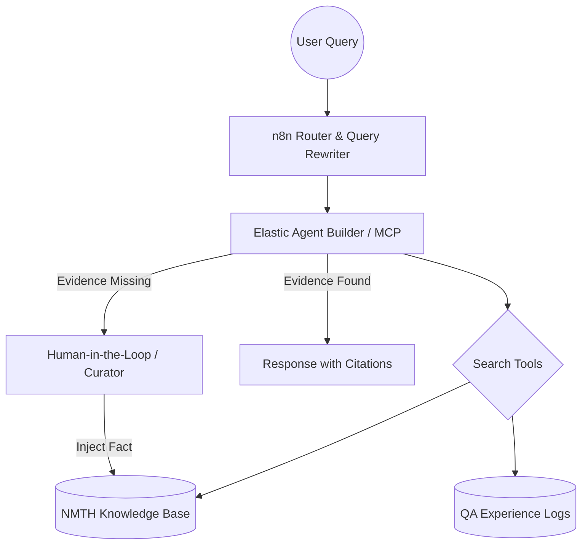

# 🏛️ SLEUTH-Archivist: Self-Improving Agentic RAG for Cultural Heritage

> **Built for the Elasticsearch Agent Builder Hackathon 2026**
> A multi-agent system combining **n8n** and **Elasticsearch MCP** to solve "Evidence Sparsity" through Agentic Context Engineering (ACE).

---

## 🎬 Hero Demo & Visuals

### **The Intelligent Loop in Action**

*Integrated reasoning between n8n Orchestrator and Elasticsearch Knowledge Base.*

---

## 💡 Overview
SLEUTH-Archivist is a specialized AI archivist built for the **National Museum of Taiwan History (NMTH)**. It addresses the critical issue of **"Evidence Sparsity"** (inspired by the SLEUTH framework) in traditional RAG systems. 

By implementing an **Agentic Context Engineering (ACE)** loop, our system transitions from a static RAG to a self-improving expert system. It doesn't just "search"; it **reasons, identifies gaps, and learns from Human-in-the-Loop (HITL) feedback.**

### 🚀 Technical Highlights
* **Anti-Hallucination Protocol**: Implements a strict `evidence_check` via Kibana MCP. If quantitative facts are missing, the agent triggers a `knowledge_gap` status instead of hallucinating.
* **Early Experience (EE) Learning**: Treats historical QA logs (`nmth-qa-logs`) as a **World Model**, allowing the agent to analyze past failures and refine its search strategy.
* **Agentic Context Engineering**: Uses n8n to perform **Query Transformation**, ensuring complex historical queries are correctly mapped to Elasticsearch's vector and semantic space.

---

## 🛠️ Architecture & Workflow

### **System Orchestration**

### **Backend: Elasticsearch Managed Indices**

We manage two distinct indices to facilitate self-improvement:

1. **`nmth-knowledge-base`**: Official museum records.
2. **`nmth-qa-logs`**: Capturing agent experiences and user feedback.

### **Agent Tools & Logic**

### **n8n Multi-Agent (+MCP) Workflow**

---

## 🎬 Demo Scenario: The Self-Improving Loop

1. **The Gap**: A user asks for "17th-century VOC map preservation standards". The Agent detects missing facts and returns a structured `{"status": "knowledge_gap"}`.
2. **The Expert (HITL)**: The museum curator reviews gap logs and injects the official standard (20°C / 50% RH) into Elasticsearch.
3. **The Evolution**: Upon the next identical query, the Agent retrieves the newly available context, fulfilling the **ACE loop** to provide a hallucination-free answer.

---

## 📦 Setup & Deployment

1. **Environment Variables**: Copy `.env.example` to `.env` and fill in your `ELASTIC_API_KEY`, `ELASTIC_ENDPOINT`, and `MCP_SERVER_URL`.
2. **Import Workflow**: Import `workflows/sleuth-archivist-v1.json` into your n8n instance.
3. **Elasticsearch**: Ensure your indices are mapped with the provided configurations in the `/agents` folder.

---

## 🎥 Video Demo & Community

* **Watch the Demo**: [🔗 YouTube: SLEUTH-Archivist Demo](https://youtu.be/rfEJS_rWBTw)
* **Social**: [🔗 Share on X/Twitter](https://www.google.com/search?q=YOUR_SOCIAL_LINK_HERE)

